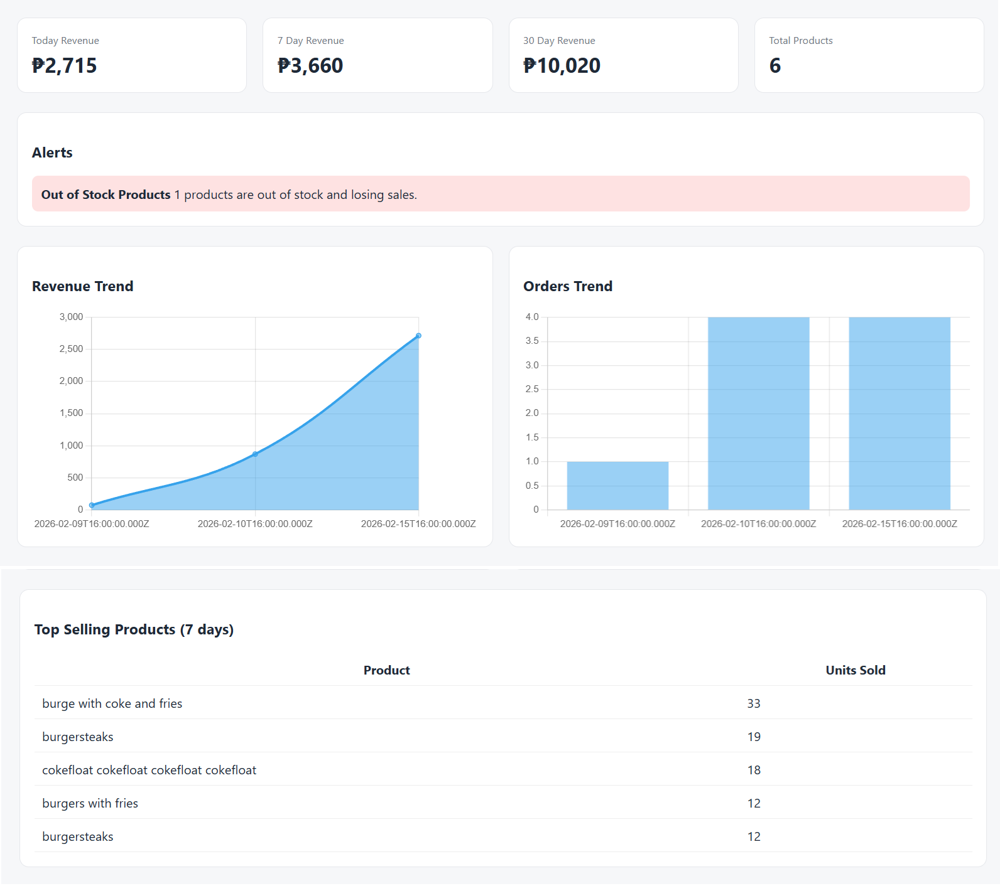
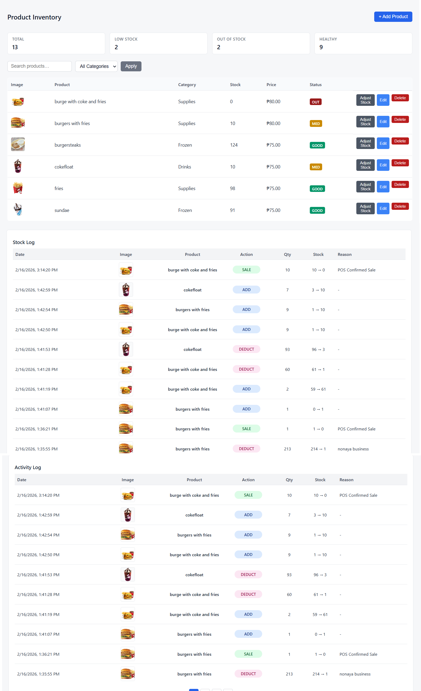
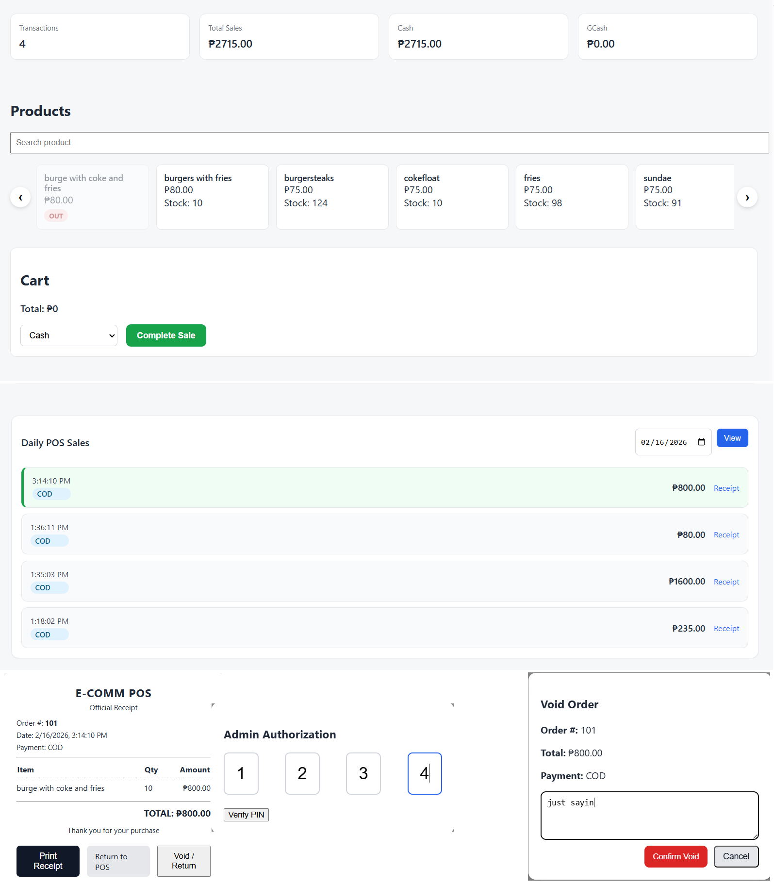
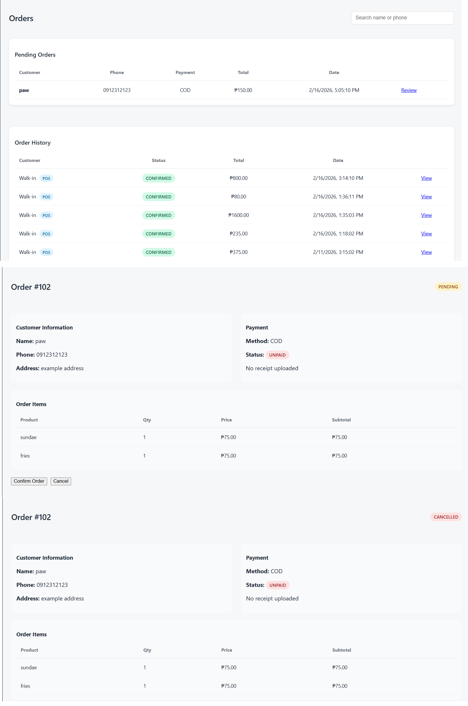
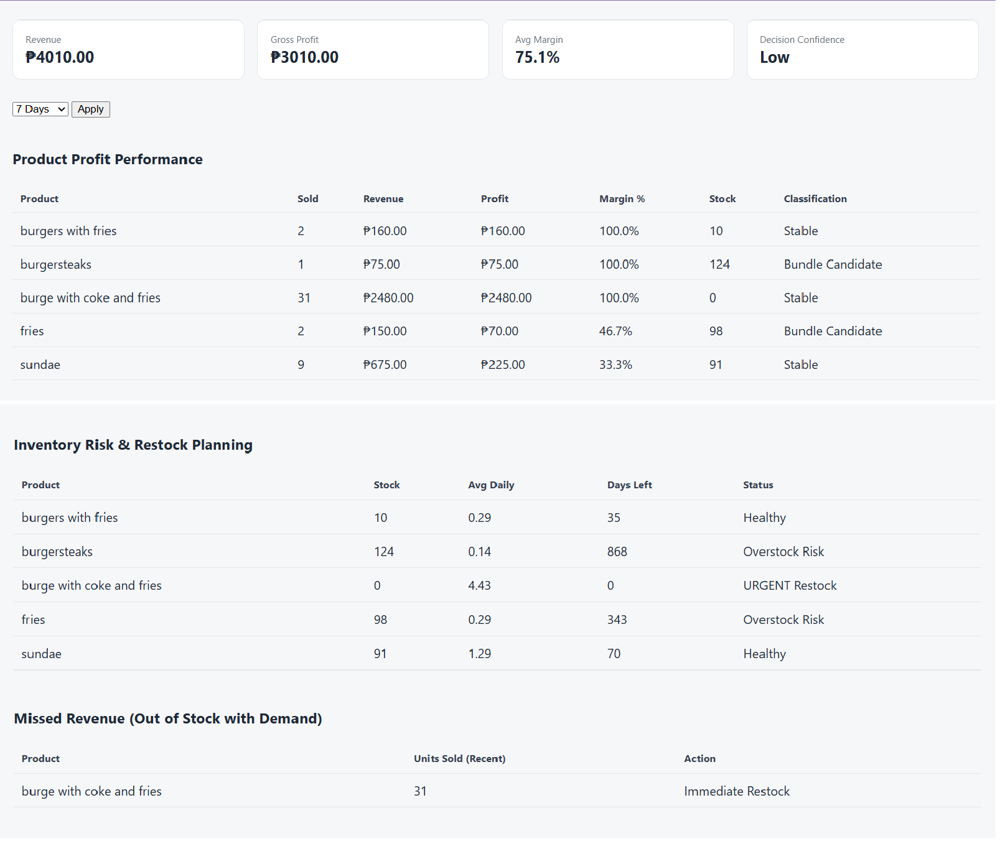
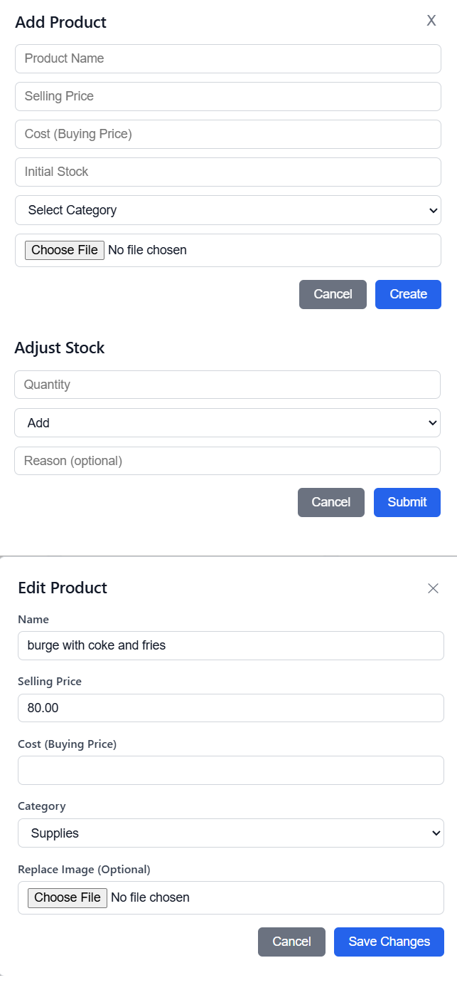

# 🧾 POS & Inventory Management System (Full Business Admin SaaS)

A full-stack business management system designed for small retail shops to manage products, stock, sales, POS transactions, and business analytics.

This project simulates a real production admin panel used by store owners to avoid losses and increase profit through automated insights.


## 📸 Screenshots

### Dashboard


### Product Management


### POS System


### Orders Management


### Business Strategy Panel


### Product CRUD & Logs



-

-

-

-

## 🎯 The Problem

Small business owners often manage their stores using spreadsheets or manual tracking.

Common problems:
- Stock running out without noticing
- Dead stock wasting capital
- No clear view of profit vs revenue
- No decision guidance for restocking or bundling
- Manual POS without safety mechanisms

This project was built to simulate a real admin SaaS that solves these problems.

-

-

-

-

-

## 💡 The Solution

I built a complete Admin SaaS that combines:

• POS system  
• Inventory tracking  
• Profit analytics  
• Automated business alerts  
• Sales strategy recommendations  

The system helps managers:
- Avoid stockouts
- Detect slow products
- Identify high-profit items
- Make better restocking decisions

-

-

-

-

-

## 🚀 Key Features

### 🛒 POS System
- Walk-in POS checkout
- Undo sale (10-second safety window)
- Admin-approved VOID system (PIN protected)
- Automatic stock deduction + reversal logs
- Receipt generation

### 📦 Inventory Management
- Product CRUD with activity logs
- Stock adjustment with full history
- Low stock + out of stock indicators
- Soft delete (products hidden but preserved for history)

### 📊 Strategy & Analytics Panel
Smart business intelligence system that analyzes past sales to generate:

- Profit performance per product
- Inventory risk detection
- Missed opportunity detection
- Bundle candidate suggestions
- Dead stock alerts
- Decision confidence scoring

### 📈 Business Dashboard
- Revenue & Orders trends
- KPI metrics (Revenue, Profit, Avg Order)
- Top selling products
- Automated business alerts

-

-

-

-

-

## 🧠 What Makes This Project Different

This is not just CRUD.

The system includes **business intelligence logic**:
- Profit analysis (not only sales)
- Opportunity cost detection
- Automated decision suggestions
- Safety mechanisms for human mistakes (undo/void)
- Audit logging for all critical actions

This simulates a real production admin SaaS.

-

-

-

-

-

## 🏗️ Tech Stack

**Backend**
- Node.js
- Express
- MySQL (mysql2)
- EJS templating

**Frontend**
- Vanilla JavaScript
- CSS
- Chart.js

**Security**
- Helmet (CSP enabled)
- Admin PIN verification
- Audit logging

-

-

-

-

-

## ⚙️ How to Run Locally

1. Clone the repo
2. Install dependencies

```bash
npm install

CREATE DATABASE ecomm_pos2;

DB_HOST=localhost
DB_USER=root
DB_PASS=
DB_NAME=ecomm_pos2

npm run dev

http://localhost:3000/admin

-

-

-

-

-


---

## 🧩 Future Improvements

Shows growth mindset.

```md
## 🧩 Future Improvements

- Multi-store support
- Supplier management
- Purchase order system
- Customer analytics
- Online storefront integration

-
-
-
-
-
## 👨‍💻 Author

Built by **Paolo Francis**  
Aspiring Full-Stack Developer
